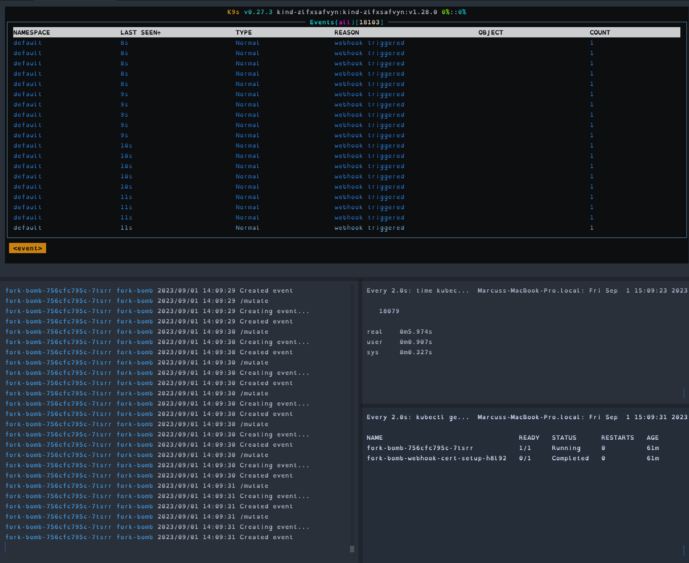

# fork-bomb

In this scenario our webhook handler generates a new Event resource to record that the webhook was triggered. This in turn triggers our webhook against the Event resource which generated another Event and so on.

This scenario isn't entirely unreasonable. A lot of validating and mutating webhooks are configured to respond to all resources types (⚠️) for various reasons. It's not impossible that someone might decide to add Events to the webhook with the aim of improving visibility of the webhook actions without realising this will efectively cause a [fork bomb](https://en.wikipedia.org/wiki/Fork_bomb).

## Impact

The cluster will be find initially, providing the webhook handler doesn't wait for successful creation of the Event.

The api-server will continue to handle requests and as long as the webhook handler is able to handle the amount of requests it should continue without blocking anything.

But in the background the Events in the cluster are building up. After just a few minutes there'll be 1000's of Events. This number will keep increasing, leading to usage of etcd storage and resources.

Depending on cluster configuration (see the `--event-ttl` api-server flag) this could potentially take down etcd eventually and cause a cluster outage. At the very least it's likely to cause increasing slowdown for any applications working with Events in the cluster.

After 1 hour

## Solutions

* Ensure `--event-ttl` is set to a sensible value relevant to the size of your cluster and the amount of activity it see.
* If your webhook handler generates Kubernetes resources make sure they don't trigger your webhook by making use of `objectSelector` and labels to ignore specific resources.
